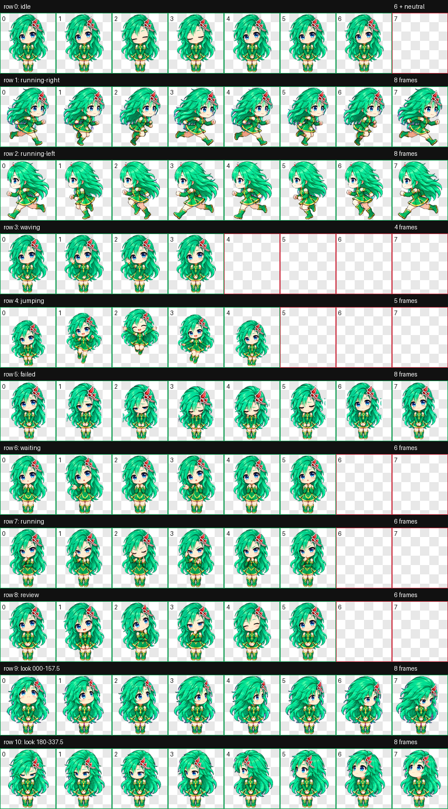

# Rydia · FF4 Codex 桌面宠物

根据莉迪亚参考图制作的可爱 Q 版桌面宠物：翡翠绿长发、蓝眼睛、红色发饰与金边绿裙。


## 下载与安装

下载 [Rydia 宠物包](downloads/rydia-pet.zip)，解压后将 `rydia` 文件夹复制到 `~/.codex/pets/`。

如果已克隆本仓库，可在仓库根目录执行：

```sh
mkdir -p "${CODEX_HOME:-$HOME/.codex}/pets/rydia"
cp rydia/pet.json rydia/spritesheet.webp "${CODEX_HOME:-$HOME/.codex}/pets/rydia/"
```

在应用的「设置 → 宠物」中刷新列表，选择 **Rydia**，然后输入 `/pet` 唤醒。

## 内容

- [宠物配置](rydia/pet.json) 与 [透明动画图集](rydia/spritesheet.webp)。
- 9 组标准动作：待机、向右移动、向左移动、挥手、跳跃、失败、等待回应、工作、检查结果。
- 16 个顺时针观察方向。
- v2 格式，8 列 × 11 行，单格 192 × 208，图集 1536 × 2288。
- [制作说明与提示词](docs/generation-notes.md)。



## 制作与保存

2026-09-10 制作，使用内置 imagegen 生成形象与动作，经过图集尺寸、透明度、边缘和方向视觉校验。2026-09-11 保存至本仓库。

本仓库是个人收藏的非官方 FF4 Rydia 同人宠物素材，不代表官方作品。
